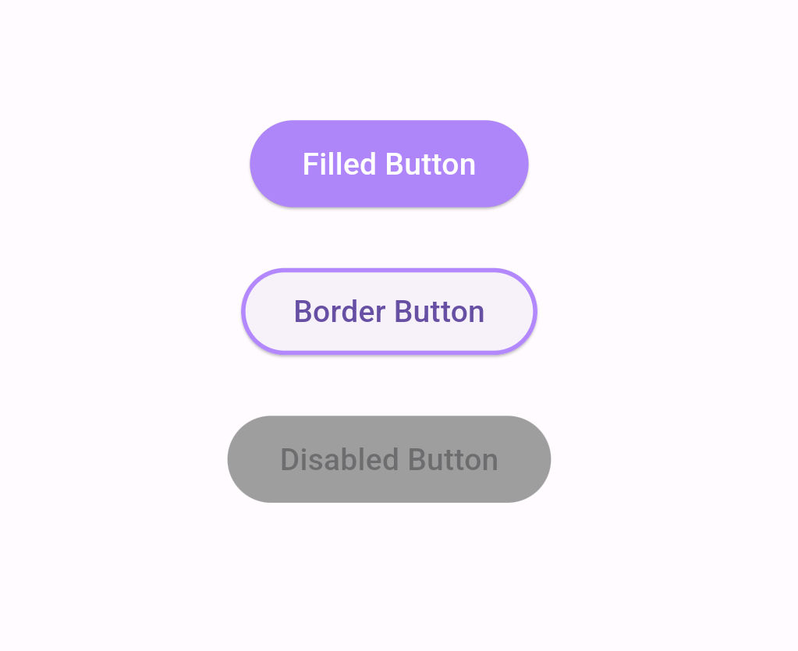

# Core Buttons 
A flutter widget for the core button

The Core Buttons package lets you add buttons to your Flutter app.

## Installation 

1. Add the latest version of the package to your pubspec.yaml (and run`dart pub get`):
```yaml
dependencies:
  pm_core_button: ^0.0.1
```
2. Import the package and use it in your Flutter App.
```dart
import 'package:pm_core_button/pm_inx.dart';
```

## Example
There are several properties that you can modify:

 - height
 - width               
 - title 
 - Enable - Disable functionality
 - border-color
 - text color
 - font family
 - shape

<hr>

<table>
<tr>
<td>

```dart
class MyApp extends StatelessWidget {
  @override
  Widget build(BuildContext context) {
    return MaterialApp(
      home: Scaffold(
        appBar: AppBar(
          title: const Text('PM Core Button Example'),
        ),
        body: Center(
          child: Column(
            mainAxisAlignment: MainAxisAlignment.center,
            children: [
              PMCoreButton(
                text: 'Filled Button',
                onPressed: () {
                  print('Filled Button pressed');
                },
                isEnabled: true,
                textColor: Colors.white,
                fillColor: Colors.deepPurpleAccent[100],
                // Material 3 color
                radius: 20.0, // Example border radius
              ),
              const SizedBox(height: 20),
              PMCoreButton(
                text: 'Border Button',
                onPressed: () {
                  print('Border Button pressed');
                },
                isEnabled: true,
                borderColor: Colors.deepPurpleAccent[100],
                // Material 3 color
                borderWidth: 2.0,
                // Example border width
                radius: 20.0, // Example border radius
              ),
              const SizedBox(height: 20),
              PMCoreButton(
                text: 'Disabled Button',
                onPressed: () {
                  print('Disabled Button pressed');
                },
                isEnabled: false,
                // Disable the button
                fillColor: Colors.grey,
                // Example fill color for disabled state
                radius: 20.0, // Example border radius for disabled state
              ),
            ],
          ),
        ),
      ),
    );
  }
}
```

</td>
<td>

</td>
</tr>
</table>

## Next Goals

 - [x] Add gradient buttons and animated buttons for functions.
 Now, you can get easily gradient buttons and animated buttons.
 
 - [ ] Add more buttons and functionality to the package.
